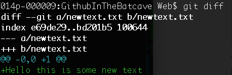
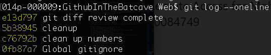

# Github in the batcave

## Here are 100 things that you need to know about git and github:

### Beginner commands
- brew install git (install github on a mac with homebrew)
- git config --global user.name "M H"
- git config --global user.email "myemail@gmail.com"
- git config --global color.ui true
- **git init**
- **git status** (Which files are staged and which need to be staged?)
- **git add .** (add all changes to staging)
- **git commit -m "Message here"** (commit staged changes)
- git commit -am "message here" (add and commit changes)
- vim .gitignore (creates a file for ignoring certain files)
  - Icon?
  - .DS_Store
  - !master.txt (do track this)
  - Icon (then press ctrl + v, enter, ctrl + v, enter, [Should look like this Icon^M^M])
  - Add to your gitignore global config file in ~/.gitignore_global.
___

### Some theory about VCS's
- Being distributed means that the whole project is available to everyone.
- There are three layers in a project
  - working directory (*factory*) (a bare clone does not have a working directory)
  - staging area (index) (*loading dock*) (pick and choose what you want to commit)
  - repository (.git folder)
- A blob (stores the content of the file)
- A git object (40 character hashing algorithm - SHA-1 hash)(compressed with z-lib)
- A tree (hierarchy between files in a Git repository)
- A commit (snapshots of the project in time)

___
### Intermediate commands

#### Git diff

- git diff README.md (difference between working directory content and staged content)
- git diff --staged README OR git diff --cached README (difference between staged content and committed content)
- git diff HEAD README (difference between working directory and committed content)
- git diff 394da3 readme (what changes happened to the readme file since that hash)
- git diff 434532 4345346 (compare the two hashes)

#### Git log
- git log (view the history of all your commits starting with the most recent commit) (press j and k or the up and down arrow keys to jump up and down. Press "q" to quit)
- git log --stat (some statistics)
- **git log --oneline** (useful for comparing commits)

- git log --graph (see a graph of the project)
- git log --pretty --graph --oneline --all --decorate (custom reports) (all branches) [http://git-scm.com/docs/git-log](http://git-scm.com/docs/git-log)
- gitk (gives you a UI for commits) (ctrl + c to cancel this gitk screen)

#### Git branch and Git checkout
- git branch (which branch are we currently on?)
- git branch experiment (make a branch called experiment)
- git checkout experiment (switch to this branch)
- git checkout -b "bugfix1" (make a new branch and check it out)
- git branch --all (all local and remote branches)

#### More advanced Git features
- alias gl='git log --oneline --all --graph --decorate' (here is a cool alias for showing the log)
- git merge bugfix1 (merge bugfix1 with the master branch)
- git branch -d bugfix1 (delete branch bugfix1 once you've merged it into master)
- git rebase experiment2 (keep your history cleaner, rewind all your work to top of master branch)

### Github
- [https://github.com/new](https://github.com/new)
- git remote add origin git@github.com:nameofrepo/project.git (git remote -v shows you the path of the remote branch)
- git push -u origin master

#### Setup your SSH on github
- Go to this page and add SSH Key [https://github.com/settings/ssh](https://github.com/settings/ssh)
- cd ~/.ssh (open all your existing keys)
- ssh-keygen -t rsa -C "myemail@gmail.com"
- cat id_rsa.pub
- (copy the contents of this and paste it into the https://github.com/settings/ssh section)
- ssh -T git@github.com (check that there is a SSH connection)
- git branch -a (look at all your master branches)
- (merge pull request)
- git pull (get all the files from github - same as performing git fetch and then git merge)
- git clone https://github.com/jashkenas/coffee-script.git
- git fetch (pull changes first from github and then merge if you want to, you can then git diff master origin/master to compare the changes and then git merge origin/master)

#### Github pages
-  Github pages allows you to host a static page

> Github pages are really valuable places for staginf or testing websites before publication.
___
### Advanced commands
- git add -i (interactive add, you can add a part of a file)
- git stash (stash changes to the side for now)
- git stash list (shows you all the stashed parts of the project)
- git stash save "I'm just keeping this on the side for now - like a temporary commit"
- git stash apply (pull the last stash back in the folder)
- git stash drop stash@{0} (delete that stash)
- git stash pop (pull the stash back in the folder and delete it)
- git push origin experiment (push your experiment branch to github)
- git diff --name-only master experiment (differences between master and experiment branches)
- git push origin --delete experiment (deletes a remote branch)

  ### Reverting to older versions
- git checkout nameoffile.txt (brings back the deleted file)
- git reset HEAD nameoffile.txt (unstage a file that was staged)
- git reset --hard HEAD (reset to last commit)
- **git revert 35454356567e4df656344**
    - first get the git log and copy the SHA-1 Hash

  ### Releasing your software
- git tag -a RELEASE001 (annotated tag, add a description in the editor)
- git show (show contents of your tags)
- git show RELEASE001 (show contents of your tags)
- git push --tags (pushes tags to github)
- git checkout RELEASE001 (go back to that release)
-
  ### Github workflow best practices
- File an issue with the project
- Forking a repo (fork the repo, then git clone then create a branch)
- Create a LICENSE
- Recommend changes to original project (new pull request)
- Accept pull requests (merge pull request, similar to a code review)
- Draft a new release (menu in the tags page. Should use github flavored markdown)
- gists (small code snippets) (link, embed or clone gists)
- git describe --tags (what releases are available)
- [http://try.github.io](http://try.github.io) (interactive tutorial)
- [http://help.github.com](http://help.github.com)

  ### Working in teams on Github

  ### Issues
- Closed issues, open issues, search and labels
- Milestones
- New Issue - add in color labels
- Related to \#1 (will link the issue to the first issue)
- fixed \#2 (in the comments will automatically close the issue)

  ### Graphs and Network
- Contributors, commits, Code frequency, punchcard

  ### Trello
-  Service hooks

  ### Continuous integration
-  Travis CI or Jenkins
-  Travis bot (read access)

  ### Hubot
